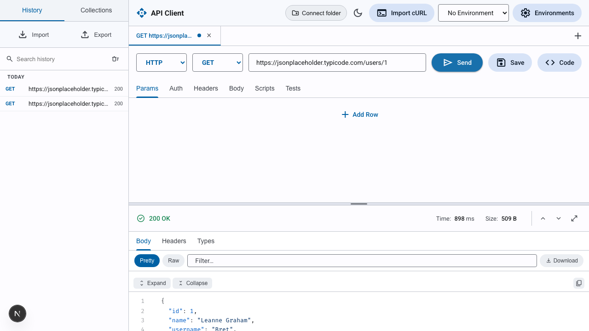

# next-postman

A free, local-first **Postman alternative** built with Next.js. Send HTTP requests, run collections, stream WebSocket/SSE, generate code and types — all in the browser, with no account, no cloud sync, and no lock-in.

The bet: don't out-feature Postman. Win on **local, git-native, no-lock-in**. Your collections and environments are plain files you own.



## Features

- **HTTP client** — methods, params, headers, multiple body types (raw/JSON/form-data/urlencoded/GraphQL), 200ms-fast UI.
- **CORS-free proxy** — requests go through a server route (`/api/proxy`), so no CORS limits and full header/cookie fidelity. Auto-falls back to a **browser-direct** send when a target's bot wall (Cloudflare/Akamai) blocks the datacenter IP.
- **Collection Runner** — run a folder of requests in sequence with chaining (a run-scoped variable bag, no environment pollution) and data-file iteration via `pm.iterationData`.
- **Realtime** — **WebSocket** (browser-direct) and **Server-Sent Events** (via a streaming proxy route) with a live message log.
- **Git-native storage** — save collections/environments to a real folder on disk via the File System Access API; secret-named env vars auto-split into gitignored `*.secret.json`. Zip export fallback for Firefox/Safari.
- **Named environments** + globals, with `{{var}}` resolution, inline autocomplete, and colored-token highlighting.
- **Auth** — none, Bearer, Basic, API Key, OAuth2, JWT.
- **Import / export** — Postman collections, **OpenAPI 3.0/3.1** (JSON + YAML, internal `$ref`, `servers`→baseUrl, tags→folders), and **cURL**.
- **Code generation** — turn any request into a runnable snippet across 12 languages.
- **Response tools** — interactive JSON tree, syntax-highlighted body, **type generation** (TypeScript, Go, Rust, Python, Dart, Kotlin, Swift, Java, C#), response **diff** against the previous run, cookie jar, and test results.
- **Scripts & tests** — pre-request and test scripts in a `pm`-style sandbox.
- **Quality of life** — `Cmd-K` command palette, tab persistence, dark mode, cURL import.

## Tech Stack

- [Next.js](https://nextjs.org) 16 (App Router) + [React](https://react.dev) 19
- [Zustand](https://github.com/pmndrs/zustand) 5 for state
- TypeScript, Material 3-style design
- [Vitest](https://vitest.dev) — 188 tests across the request pipeline, parsers, and proxy route
- Fonts self-hosted via [`next/font`](https://nextjs.org/docs/app/api-reference/components/font) (Roboto + Fira Code)

## Getting Started

```bash
npm install
npm run dev
```

Open [http://localhost:3000](http://localhost:3000).

Other scripts:

```bash
npm run build      # production build
npm run test       # vitest
npm run typecheck  # tsc --noEmit
npm run lint       # eslint
```

## Project Structure

```
src/
  app/
    api/proxy/route.ts    # CORS-free request proxy (decompress-safe)
    api/stream/route.ts   # SSE streaming proxy
    layout.tsx, page.tsx
  features/api-client/
    components/           # UI (UrlBar, RequestPane, ResponsePane, modals, ...)
    lib/                  # request pipeline, parsers, codegen, storage, realtime
    store/                # Zustand store + selectors
    types.ts
```

## Related Work

How next-postman compares to the tools it learns from:

| Tool | Model | Storage | Lock-in |
| --- | --- | --- | --- |
| **next-postman** | Free, local-first, browser-based | Plain files on disk (git-native) | None |
| [Postman](https://www.postman.com) | Freemium SaaS, account + cloud sync | Cloud workspaces | Account-gated features, cloud sync |
| [Insomnia](https://insomnia.rest) | Open-source desktop, account for sync | Local + optional cloud | Account for sync/collaboration |
| [Hoppscotch](https://hoppscotch.io) | Open-source, web + self-host | Browser/local + cloud | Low; self-hostable |
| [Bruno](https://www.usebruno.com) | Open-source desktop, offline-first | Plain `.bru` files in git | None |
| [HTTPie Desktop](https://httpie.io/desktop) | Freemium desktop | Local + cloud spaces | Account for spaces |
| [curl](https://curl.se) | CLI | Shell scripts | None |

next-postman is closest in spirit to **Bruno** (git-native, no-lock-in) but runs in the browser with a server-side proxy for CORS-free requests, plus a built-in collection runner, realtime (WS/SSE), and code/type generation.

### Concepts borrowed

- The `{{variable}}` + `pm.*` sandbox model from Postman/Newman.
- Git-friendly, plain-file storage from Bruno.
- OpenAPI import to bootstrap collections from an existing spec.

## License

[MIT](LICENSE) © Shamirul Islam
